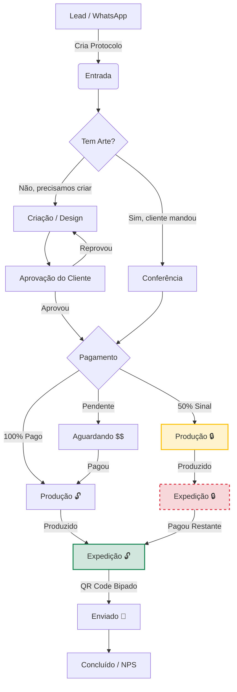

# [RFC] Separação Pré-Venda vs Pós-Venda

* **Status**: Draft
* **Data Alvo**: 2026-02-01
* **Prioridade**: Alta

## Resumo
Este plano define a separação estratégica e técnica entre os fluxos de **Pré-Venda** (foco em conversão) e **Pós-Venda** (foco em retenção e serviço) no SiteMarcaViva.

## Problema / Motivação
"Misturamos coisas de pré-venda com pós-venda".
*   **Sintoma**: O código de checkout tenta lidar com status de pedido. O painel admin mistura leads com clientes fiéis.
*   **Impacto**: Código complexo, risco de bugs e UX confusa.
*   **Objetivo**: Criar limites claros (Bounded Contexts).

---

## 1. O Conceito: "Protocolo" (Flexível)
A ideia central muda de "Pedido Rígido" para **"Protocolo de Atendimento"**.
*   **O que é**: Um container flexível que nasce no primeiro contato (WhatsApp/Site) e acompanha o cliente até a entrega.
*   **Identificador**: Código único (Ex: `#MV-2026-X9Y`).
*   **Conteúdo Flexível**: Pode começar só com uma dúvida e depois ganhar produtos, arquivos de logo, e prazos.

## 2. A Experiência (Os Dois Lados)

### 🏢 Visão Interna (O "Trello" da Marca Viva)
Para a equipe, não é uma lista chata. É um **Kanban Visual** (Quadro tipo Trello).

*   **Colunas Sugeridas** (Totalmente editáveis):
    1.  📥 **Entrada/Lead** (Contato inicial)
    2.  🎨 **Arte/Layout** (Criando mockup)
    3.  💰 **Aguardando Pagamento**
    4.  🏭 **Em Produção** (Onde a mágica acontece)
    5.  📦 **Expedição/Pronto**
*   **Ação**: Você arrasta o card do cliente de uma coluna para outra.
*   **Flexibilidade**: Pode adicionar notas, fotos da produção e mudar o prazo a qualquer momento.

### 👤 Visão do Cliente (Rastreio)
O cliente recebe um link do Protocolo (sem precisar logar necessariamente, ou via área logada).

*   Ele vê uma **Timeline** (Linha do tempo).
*   Exemplo: *"Seu pedido #MV-X9Y saiu de 'Arte' e foi para 'Em Produção'!"*
*   Ele pode aprovar o layout direto nessa tela.

---

## 3. Estratégia Técnica

### Banco de Dados
*   [ ] **Tabela `protocols`**: Substitui ou engloba `leads` e `orders`.
    *   Campos: `status_column`, `client_data`, `notes`.
*   [ ] **Tabela `protocol_items`**: Produtos dentro do protocolo.
*   [ ] **Tabela `pipeline_stages`**: As colunas do seu "Trello" (para ser configurável).

### Interface (UI)
*   **Admin**: Usar biblioteca `SortableJS` para criar o efeito de arrastar colunas/cards.
*   **Cliente**: Página limpa tipo "Domino's Pizza Tracker", focado no status visual.

---

## 4. O "Ecossistema Completo" (Pensando em Tudo)

Para que o sistema rode sozinho, precisamos definir as regras invisíveis:

### 🔔 Automação de Notificações (O "Robô")
Quando você arrasta um card, o sistema avisa o cliente automaticamente.
*   `Lead` → `Criando Arte`: Envia "Olá! Nosso designer já pegou seu pedido."
*   `Criando Arte` → `Aprovação`: Envia "Seu layout está pronto! Clique aqui para aprovar."
*   `Em Produção` → `Expedição`: Envia "Seus brindes ficaram prontos! Estamos embalando."
*   **Canais**: WhatsApp (via API) e E-mail.

### 📂 Central de Arquivos (Asset Management)
Cada Protocolo tem sua própria "Pasta Segura" na nuvem.
*   **Entrada**: Cliente faz upload do Logo (Vetor/PDF) no checkout/contato.
*   **Interno**: Designer sobe o "Mockup Virtual" para aprovação.
*   **Saída**: Nota Fiscal e Foto do produto pronto (para o cliente ver antes de enviar).

### 🛡️ Níveis de Acesso (Quem faz o quê)
*   **Admin/Dono**: Vê tudo, move tudo, edita preços financeiro.
*   **Designer**: Só vê colunas "Criando Arte" e "Aprovação". Sobe arquivos.
*   **Produção**: Só vê "Em Produção". Dá check nos itens fabricados.
*   **Vendedor**: Vê "Leads" e "Negociação".

### 🔗 Integração com o Site Atual
*   **Checkout**: Não morre. Ele vira o "Gerador de Protocolo".
    *   Pedido pago no site = Card automático na coluna "Aguardando Produção".
    *   Pedido boleto/pix pendente = Card automático na coluna "Aguardando Pagamento".
    *   Abandono de carrinho = Card na coluna "Lead/Recuperação".

---

## 5. Próximos Passos (Plano de Ação)

1.  Aprovar este conceito expandido.
## 6. Ideias de Valor Agregado (Brainstorm) 💡

Coisas que podemos colocar para "turbinar" o sistema:

### A. Gerador de Orçamento em PDF (Automático)
*   **Problema**: Empresas precisam de um "Papel" para aprovar a compra com o financeiro.
*   **Solução**: No card do Lead, um botão **"Gerar PDF"**. O sistema cria um orçamento lindo com sua logo, validade de 5 dias e dados bancários, pronto para enviar no Zap.

### B. "Renovar Estoque" (Recompra em 1 Clique)
*   **Cenário**: O cliente comprou canecas ano passado e quer mais iguais.
*   **Solução**: No histórico, um botão "Pedir Novamente". O sistema duplica o Protocolo antigo, já com a arte e produtos, direto para a coluna "Aprovação" (pula a Arte).

### C. Alerta de "Gargalo" (SLA)
*   **Problema**: Pedido parado na "Criação" há 3 dias.
*   **Solução**: O card muda de cor (fica vermelho) se ficar mais de 24h na mesma coluna. Ajuda você a cobrar a equipe.

### D. Link de "Aprovação VIP"
*   **Detalhe**: Ao invés de mandar só a foto do mockup, mandamos um link onde o cliente vê o mockup e tem dois botões grandes:
    *   🟩 **APROVAR ARTE** (O card move sozinho para "Produção").
    *   🟥 **PEDIR ALTERAÇÃO** (O card volta para "Criação" com o comentário dele).
*   *Elimina o "disse-me-disse" do WhatsApp.*

## 7. Adaptações para Alta Escala (O "Power Mode") 🚀

Baseado no seu feedback [Flexibilidade Financeira + Volume Alto]:

### E. Controle Financeiro Híbrido (O "Sinal")
*   O card terá uma **Barra de Progresso de Pagamento**:
    *   Opção 1: **100% Antecipado** (Barra Verde Cheia) -> Libera expedição.
    *   Opção 2: **50% Sinal** (Barra Amarela/Metade) -> Libera produção, mas **BLOQUEIA** a expedição com um cadeado vermelho até quitar.
*   *Evita o erro de entregar sem receber o resto.*

### F. Fluxo de Arte Inteligente (Bifurcação)
Ao criar o protocolo, escolhemos a origem:
1.  **"Cliente enviou pronta"**: O card **PULA** a coluna "Criação" e vai direto para "Conferência" (só checar se a imagem tá boa). Economiza tempo.
2.  **"Nós criamos"**: Vai para a fila do Designer.

### G. Etiquetas de Fábrica com QR Code
*   **Para alto volume**: O sistema gera uma etiqueta PDF para colar na caixa/pacote de brindes.
*   **Mágica**: O estoquista aponta a câmera do celular pro QR Code da caixa e o sistema marca como "Enviado" automaticamente.
*   *Zero clique no computador para o pessoal do chão de fábrica.*

### H. Gamificação de Vendas (Painel de Metas)
*   Como teremos muitos pedidos, colocamos um "Placar" no topo do Admin:
    *   "Meta do Mês: R$ 100k" (Barrinha enchendo).
    *   Motiva o time a empurrar os cards para a direita (faturar).

## 8. O Fluxo Passo-a-Passo (Mermaid Flowchart) 🔄

Visualizando o caminho de um pedido:

### Exemplo Prático: "Pedido das Canecas da Julia"

1.  **Entrada**: Julia chama no Zap querendo 50 canecas. Vendedor cria o card `#MV-100`.
2.  **Arte**: Julia não tem arte. O card vai para **Criação**. Designer faz o mockup e sobe no sistema.
3.  **Aprovação**: Julia recebe o link, acha lindo e clica em **APROVAR**.
4.  **Pagamento**: Julia paga 50% no Pix. O card vai para **Produção**, mas ganha um cadeado vermelho 🔒.
5.  **Produção**: A fábrica estampa as canecas. O estoquista move para **Expedição**.
6.  **Bloqueio**: O estoquista tenta bipar pra enviar, mas o sistema avisa: *"Falta pagar R$ 500,00"*.
7.  **Liberação**: Vendedor avisa a Julia. Ela faz o resto do Pix. Vendedor dá baixa. O cadeado abre 🔓.
8.  **Envio**: Estoquista bipa a caixa. Motoboy leva. Julia recebe e avalia com 5 estrelas.

## 9. Estratégia do Catálogo (O Imã de Leads) 🧲

Para alimentar esse "Trello" de produção, o catálogo precisa ser agressivo na captura. Sugestões:

### A. Preço Escalonado (Atacado Inteligente)
Em vez de um preço só, mostramos uma tabela dinâmica:
*   🟢 **1 a 10 unid**: R$ 45,00
*   🟡 **11 a 50 unid**: R$ 38,00 (Destaque "Mais Vendido")
*   🔵 **+100 unid**: R$ 32,00
*   *Efeito*: O cliente que ia comprar 8 acaba levando 12 para pegar o desconto.

### B. "Carrinho de Orçamento" (Não é só Compra)
Muitas empresas não podem passar o cartão na hora.
*   Botão Principal: **"Adicionar ao Orçamento"**.
*   No checkout, opção: **"Gerar Proposta PDF"**.
*   Isso cria um **Lead** direto na sua coluna de entrada do Kanban, já com os itens selecionados. O vendedor só liga para fechar.

### C. Simulador de Logo Simplificado (O "Uau")
*   Um botão "Ver com minha Logo" na página do produto.
*   O cliente sobe o logo dele e o site aplica (como uma figurinha simples) em cima da foto da caneca.
*   Não é o mockup final (que o designer faz), mas ajuda a vender a ideia na hora.

### D. Montador de Kits (Onboarding)
*   Uma página especial: "Monte o Kit de Boas Vindas".
*   Passo 1: Escolha a Mochila.
*   Passo 2: Escolha a Caderneta.
*   Passo 3: Escolha a Caneta.
*   **Resultado**: Um preço único pelo Kit e um protocolo já organizado.

### E. Categorias por "Momento"
Além de "Canecas" e "Camisetas", ter categorias vendedoras:
*   🚀 "Para Startups"
*   👩‍⚕️ "Setor de Saúde"
*   🎄 "Brindes de Final de Ano"
*   Isso guia o cliente que não sabe o que quer.

---

## 10. Resumo Executivo (A "Big Picture") 🌍

Transformamos o SiteMarcaViva de uma simples loja em uma **Plataforma de Gestão de Brindes**.

1.  **O Coração**: Tudo agora é um **Protocolo**. Não é só um pedido, é um projeto vivo que aceita arquivos, prazos e mudanças.
2.  **Sua Visão (Admin)**: Um **Kanban (Trello)** onde você controla visualmente cada etapa da produção. Nada escapa.
3.  **Visão do Cliente**: Um **Rastreador Simples** (tipo Pizza) onde ele vê o progresso e aprova a arte com 1 clique.
4.  **Automação**: O sistema cobra o cliente, avisa no WhatsApp e bloqueia a expedição se não tiver pago.
5.  **Catálogo B2B**: Orçamentos em PDF, kits prontos e preços que caem com o volume.

**Resultado Final**:
*   Menos tempo no WhatsApp respondendo "Tá pronto?".
*   Mais segurança financeira (zero calote).
*   Processo de arte/aprovação 3x mais rápido.
*   Cliente sente que está comprando de uma fábrica profissional.

---

## 11. O Que Precisa Mudar? (Raio-X Técnico) 🛠️

Para isso sair do papel, vamos mexer em **35% do sistema atual**. Aqui está a lista detalhada:

### A. Banco de Dados (Supabase)
*   [ ] **Nova Tabela `protocols`**: A "mãe" de tudo. Colunas: `id`, `client_id`, `status_column`, `payment_status`, `total_amount`.
*   [ ] **Nova Tabela `protocol_items`**: O que tem dentro do protocolo (produtos, qtde, preço negociado).
*   [ ] **Nova Tabela `kanban_columns`**: Para você poder editar os nomes das colunas (Ex: mudar "Arte" para "Design").
*   [ ] **Nova Tabela `protocol_history`**: O "dedo-duro". Registra: *"João moveu de Arte para Produção às 14:30"*.
*   [ ] **Alteração em `products`**: Adicionar campos JSON `price_tiers` (para o preço de atacado).

### B. Arquivos e Páginas (Frontend)
*   [ ] **CRIAR `admin/kanban.html`**: A tela mais complexa. Usa `SortableJS` para arrastar.
*   [ ] **CRIAR `track.html`**: A tela simples pro cliente ver o status (sem senha, só com link secreto).
*   [ ] **CRIAR `scripts/services/KanbanService.js`**: A lógica de mover cards e salvar.
*   [ ] **CRIAR `scripts/services/WhatsAppService.js`**: Para gerar os links de "Olá, seu pedido mudou".
*   [ ] **MODIFICAR `product.js`**: Precisa ler a tabela de preços nova (10unid vs 100unid).
*   [ ] **MODIFICAR `checkout.js`**: Parar de gravar na tabela antiga `orders` e gravar em `protocols`.

### C. Storage (Arquivos)
*   [ ] **Nova Estrutura**: Criar pasta `protocols/{id_do_protocolo}/`.
*   [ ] **Regra de Segurança**: Pasta pública para leitura (pro cliente ver), mas escrita só do Admin/Designer.

### D. Integrações Externas
*   [ ] **WhatsApp**: Vamos precisar de uma lógica simples: quando mover o card, o sistema abre o WhatsApp Web já com a mensagem pronta. (Automação "Semi-manual" para começar sem custo).

### E. O que NÃO muda (Fica igual)
*   Login e Cadastro de usuários.
*   Home, Sobre, Contato.
*   O layout base (Header/Footer).

### F. Cronograma Sugerido
1.  **Semana 1**: Banco de Dados + Migração do Checkout (O "Coração").
2.  **Semana 2**: Painel Admin (Kanban) + Tela de Rastreio (O "Corpo").
3.  **Semana 3**: PDF, Notificações e Testes (O "Acabamento").

---

## 12. Relatório de Impacto no Cliente (O Que Muda pra Ele?) 📊

Resumo das melhorias diretas na Experiência de Compra (UX):

| Situação | **Hoje (Atual)** 😕 | **Futuro (Protocolo)** 🤩 |
| :--- | :--- | :--- |
| **Orçamento** | Print de tela ou Texto no WhatsApp. | **PDF Profissional** com validade e dados bancários. |
| **Status** | Cliente pergunta "E aí?" a cada 2 dias. | **Timeline em Tempo Real** (ele olha e não pergunta). |
| **Aprovação** | "Manda a foto de novo, não carregou". | **Link de Aprovação** em alta resolução com botão "Aprovar". |
| **Pagamento** | Manda comprovante e espera confirmação humana. | **Barra Financeira** que muda de cor sozinha. |
| **Recompra** | Explica tudo de novo o que quer. | **Botão "Pedir Novamente"** (traz logo e cor salvos). |
| **Sentimento** | "Será que eles são organizados?" | "Essa empresa é Technology-Driven." |

---

## 13. Requisitos Confirmados (Pós-Discovery) �

Baseado na nossa conversa, estas funcionalidades **SERÃO IMPLEMENTADAS**:

### 1. Amostra Física (Check de Segurança)
*   Alguns pedidos exigem ver a peça física.
*   **Solução**: Adicionar checkbox no Kanban: `[ ] Enviar Amostra Física?`.
*   Se marcado, cria uma subtarefa "Aguardando Amostra chegar no cliente".

### 2. Logística "Multi-CD" (Entregas Fracionadas)
*   **Solução**: O Protocolo permite **Múltiplos Endereços**. (Ex: 50 pra SP, 50 pro Rio).

### 3. Furo de Fila Financeiro (Cliente VIP)
*   **Solução**: Botão "Aprovação de Crédito" libera produção sem sinal.

### 4. Brand Kit (Cofre da Marca)
*   **Solução**: Sistema salva logo do cliente para recompra fácil.

---

## 14. Impacto no Legado (O que acontece com o atual?) 🏗️

Você perguntou exatamente o que muda nas "outras coisas". Aqui está a resposta fria:

### A. O Site (Loja)
*   **Home (`index.html`)**: **ZERO MUDANÇA**. Continua igual.
*   **Página de Produto**: **MUDANÇA MÉDIA**.
    *   Vai ganhar tabela de preço por quantidade.
    *   Vai ganhar botão "Simular Logo".
    *   *Visualmente muda pouco, mas o código fica mais esperto.*
*   **Carrinho**: **MUDANÇA ALTA**.
    *   Ganha botão "Gerar Orçamento PDF".
    *   Ganha lógica para não perder o carrinho se fechar a aba.

### B. O Painel Admin (`admin/`)
*   **Painel Atual**: **VAI MORRER** (Gradualmente).
    *   Hoje ele é uma lista simples de pedidos.
    *   Vai ser substituído pelo **Kanban**.
*   **Cadastro de Produtos**: **MUDANÇA ALTA**.
    *   Teremos que editar produto por produto para colocar os preços de atacado (10un, 50un, 100un). **Isso vai dar trabalho manual.**

### C. O Banco de Dados
*   **Dados Antigos**: **NÃO APAGA**.
*   Mantemos o histórico, mas os pedidos novos só entram na tabela nova `protocols`.

### D. O Servidor (Hospedagem)
*   **ZERO MUDANÇA**. Continua rodando no Vercel/Supabase. Não precisa pagar nada a mais.

***

**Próximo Passo**: Rodar Script SQL de Criação.

## 15. Melhorias Holísticas (O Que Mais Podemos Fazer?) 🚀

Já que vamos "abrir o capô" do projeto, aqui estão as melhorias de engenharia para deixar o site não só funcional, mas **Rápido e Robusto**:

### A. Performance (Velocidade)
*   [ ] **Imagens WebP**: Criar um script que converte todas as fotos dos produtos para `.webp` (carrega 5x mais rápido).
*   [ ] **Lazy Loading**: Só carregar as fotos do catálogo quando o cliente rolar a tela.
*   [ ] **CDN**: Usar o Supabase Storage com Cache para as fotos não "piscarem".

### B. SEO (Google)
*   [ ] **Sitemap Automático**: Gerar um `sitemap.xml` dinâmico sempre que você cadastrar um produto novo (pro Google achar rápido).
*   [ ] **Meta Tags Dinâmicas**: O título da página virar "Caneca Personalizada em BH | Marca Viva" automaticamente.

### C. Segurança (Blindagem)
*   [ ] **Rate Limiting**: Bloquear robôs que tentam fazer 1000 orçamentos por segundo.
*   [ ] **Backups Diários**: script para baixar o banco de dados todo dia às 3am e salvar no seu PC.

### D. Qualidade de Código (Manutenção)
*   [ ] **Componentização Real**: Tirar o HTML repetido (Header/Footer) de cada arquivo `.html` e carregar via JavaScript. (Assim, se mudar o telefone no Header, muda no site todo de uma vez).

### E. Otimização CSS
*   [ ] **Minificação**: Criar um processo que "amassa" o CSS para o site carregar instantaneamente, mesmo no 4G.
