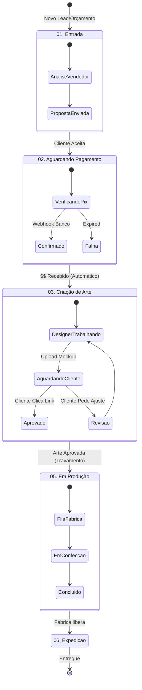

# 🗺️ Master Plan 2.0: Arquitetura Profunda do Sistema de Protocolos

> "O pedido não é mais uma linha numa planilha. É um organismo vivo que reage a pagamentos, aprovações e entregas."

Este documento detalha **profundamente** como o sistema funcionará "por baixo do capô", cobrindo Banco de Dados, Segurança e Automação.

---

## 1. Arquitetura do Sistema (O Mapa Mental)

O sistema opera em um modelo de **Máquina de Estados**. Isso significa que um Protocolo nunca está "perdido"; ele sempre tem um lugar e regras do que pode acontecer a seguir.

---

## 2. A Engenharia dos Dados (Supabase)

Para suportar essa "inteligência", o banco de dados tem 3 camadas de proteção e lógica.

### A. Estrutura Relacional (Schema)
*   **Protocols (Pai):** Guarda o Status, Cliente e Financeiro Global.
*   **Protocol_Items (Filhos):** Guarda os produtos. *Diferença Crítica:* Aqui salvamos o preço e nome **no momento da compra**. Se você mudar o preço do produto no site mês que vem, o histórico deste pedido **não** muda. Isso é vital para contabilidade.
*   **Protocol_History (O Dedo-duro):** Cada movimento de card, cada mudança de preço, cada aprovação gera uma linha aqui. Quem fez? Quando? De onde?

### B. Segurança (Row Level Security - RLS)
*   **Admin:** Vê TUDO. Pode editar TUDO.
*   **Cliente:** Só pode ver (`SELECT`) os protocolos onde `client_id` == `auth.uid()`.
*   **Cliente:** **NÃO PODE** editar (`UPDATE`) o protocolo diretamente. Ele só pode chamar "funções seguras" (ex: `approve_art()`), que garantem que ele não mude o preço ou o status financeiro de propósito.

---

## 3. Automação e Gatilhos (O "Robô")

Aqui está a lógica profunda de como o sistema trabalha sozinho (Nível Semi-Automático).

### Gatilho 1: O "Link Mágico" de Aprovação
O maior gargalo de B2B é aprovar arte.
1.  **Designer** sobe a imagem no Kanban e clica "Solicitar Aprovação".
2.  **Sistema** gera um link único e seguro, ex: `marcaviva.com/track.html?p=MV-123&token=xyz`.
3.  **Cliente** abre o link. Ele vê a imagem GRANDE e dois botões: ✅ APROVAR ou ❌ REVISAR.
4.  **Ao clicar em APROVAR:**
    *   O site dispara uma função para o Supabase.
    *   O Supabase marca `art_approved = true` e `art_approved_at = NOW()`.
    *   **Automação:** O Supabase move o card da coluna `04. Aprovação` para `05. Produção` instantaneamente.
    *   **Automação:** O Vendedor recebe um alerta: "Cliente aprovou! Pode mandar pra fábrica."

### Gatilho 2: Pagamento Inteligente
1.  **Checkout:** Cliente paga com Pix (Mercado Pago).
2.  **Webhook:** O Mercado Pago avisa nosso servidor "Pagou!".
3.  **Backend:** Procura o protocolo `MV-123`.
4.  **Ação:** Muda `payment_status` para `paid_full`.
5.  **Reação em Cadeia:**
    *   Se estava em `02. Pagamento`, move para `03. Arte` (ou `05. Produção` se for recompra sem arte nova).
    *   Envia e-mail de "Pagamento Confirmado".

---

## 4. Plano de Atualização (Roadmap de Execução)

Você pediu para "projetar uma atualização". Aqui está a ordem cronológica segura para implementar isso sem quebrar o que já existe.

### Fase 1: Fundação (JÁ FEITO ✅)
*   Estrutura de tabelas (`protocols`, `items`).
*   Interface básica Admin e Cliente.
*   Lógica de Preços B2B.

### Fase 2: O Cérebro Lógico (AGORA 🚧)
*   [ ] **Reforçar o `KanbanService.js`:** Adicionar as regras de negócio (ex: "proibir mover para produção sem arte").
*   [ ] **Criar a `ProtocolHistory`:** Tabela de auditoria.
*   [ ] **Conectar o Checkout ao Kanban:** Quando finalizar a compra, INSERIR de verdade no banco (hoje só salva o pedido "Order", precisamos criar o "Protocol").

### Fase 3: A Interface de Aprovação
*   [ ] **Upload de Arquivos:** Permitir arrastar imagens para dentro do card no Kanban (usando Supabase Storage).
*   [ ] **Visualizador do Cliente:** Atualizar o `track.html` para mostrar essas imagens e ter o botão de aprovar.

### Fase 4: Notificações
*   [ ] **Gerador de Mensagens:** Criar templates de texto para WhatsApp ("Olá {nome}, seu pedido {id} mudou...").

---

## Conclusão Técnica
Estamos construindo um **ERP Lite**. Não é apenas uma lojinha. É um sistema de gestão industrial simplificado. A complexidade está em **manter os dados sincronizados** entre o que o cliente vê e o que a fábrica faz. O uso de **Estados (States)** e **Gatilhos (Triggers)** garante que um pedido nunca fique "esquecido" no limbo.
