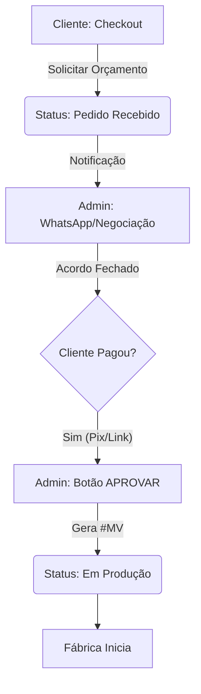

# ADR 005: Fluxo de "Pagamento Posterior" (Negociação B2B)

**Status:** Planejamento Final
**Data:** 25/01/2026

## 1. O Conceito
Em vendas B2B (Brindes), a venda não termina no carrinho. Ela **começa** ali.
O cliente pede orçamento -> Vocês negociam Arte/Prazo -> Cliente Paga -> Produção Inicia.

### 🚫 O Erro Atual
O Checkout atual obriga o cliente a pagar (Pix/Cartão) **antes** de falar com você. Isso inibe o contato.

## 2. O Novo Fluxo (Arquitetura)

## 3. Mudanças Técnicas Necessárias

### Fase 1: Destravar o Checkout (Imediato)
O objetivo é permitir que o cliente envie o pedido sem abrir a carteira.

*   **Arquivo:** `checkout.js` / `checkout.html`
*   **Ação:** Ocultar seções de pagamento (Pix/Cartão).
*   **Ação:** Mudar texto do botão para "Enviar Solicitação".
*   **Lógica:** O pedido será salvo como `inquiry` (Orçamento) sem transação financeira atrelada.

### Fase 2: O Controle do Admin (Imediato)
O admin precisa ter certeza que recebeu antes de soltar para produção.

*   **Arquivo:** `kanban.html`
*   **Ação:** Manter o fluxo atual de "Aprovar".
*   **Processo Humano:** Você só clica em "Aprovar" depois que o cliente mandar o comprovante no WhatsApp.
    *   *Nota:* Na Versão 2.0 criaremos links de pagamento automáticos.

## 4. Onde isso nos leva?
*   **Conversão Maior:** Mais gente vai mandar pedido (pois não precisa pagar na hora).
*   **Ticket Maior:** Você pode oferecer "Leve +50 e ganhe desconto" no WhatsApp.
*   **Segurança:** A produção só vê o que realmente está pago e aprovado.
